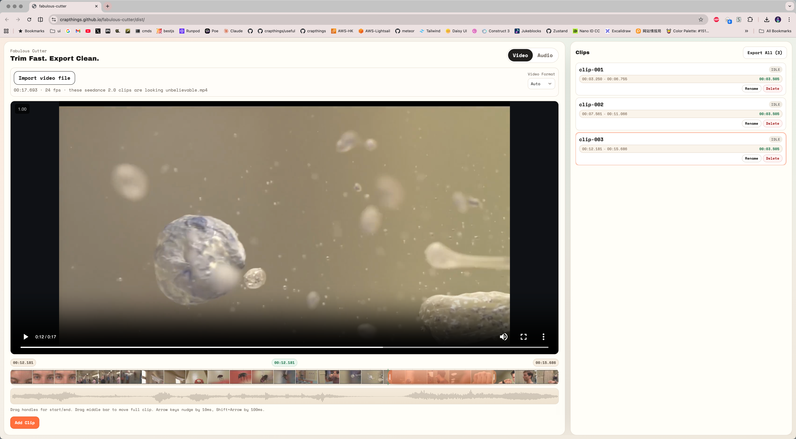

# Fabulous Cutter

Trim Fast. Export Clean.

A local-first audio/video trimming tool. Switch between `Video` and `Audio` workspaces, create multiple clips, and export them in one batch.

Live Demo: https://crapthings.github.io/fabulous-cutter/dist/



## Features

- Dual-tab workflow: `Video` and `Audio` sessions are fully isolated
- Drag trimming: left/right handles for in/out points, center area to move the whole range
- Multi-clip queue: add multiple cut points and export all at once
- Clip list management: rename, delete, drag-to-reorder, quick jump
- Real-time visual previews:
  - Video: timeline thumbnail background + separate audio waveform row
  - Audio: waveform background on timeline
- Export formats:
  - Video: `Auto / MP4 / WebM`
  - Audio: `Auto / MP3 / WAV`
- Local processing: no file upload to remote servers

## Tech Stack

- React 19 + Vite 7
- Zustand (state management)
- MediaBunny (trimming and export)
- WaveSurfer.js (waveform rendering)
- Tailwind CSS v4 (base styling integration)

## Quick Start

```bash
pnpm install
pnpm dev
```

If you use npm:

```bash
npm install
npm run dev
```

## Scripts

```bash
pnpm dev      # start dev server
pnpm build    # production build
pnpm preview  # preview production build
pnpm lint     # run ESLint
```

## How To Use

1. Choose the `Video` or `Audio` tab
2. Import a media file
3. Drag timeline handles to set the current trim range
4. Click `Add Clip` to add the range as a clip
5. Manage clips in the right `Clips` panel (rename/reorder/delete)
6. Click `Export All` to export all clips in one run

## Export Rule (`Auto`)

- Video:
  - If source extension is `webm`, prefer `webm`
  - Otherwise fallback to `mp4`
- Audio:
  - If source extension is `wav`, prefer `wav`
  - If source extension is `mp3`, prefer `mp3`
  - Otherwise fallback to `mp3`

## Keyboard

- `Space`: play/pause current trim-range preview
- `← / →`: nudge active handle by 10ms
- `Shift + ← / →`: nudge active handle by 100ms

## Project Structure

```text
src/
  components/
    EditorSection.jsx     # left editor panel
    ClipsSection.jsx      # right clip panel
  hooks/
    useTimelineInteractions.js
  store/
    editorStore.js
  utils/
    time.js
```

## Notes

- Chromium-based browsers are recommended for stable media API behavior.
- Large exports can consume significant memory; close heavy background apps if needed.

## License

MIT
